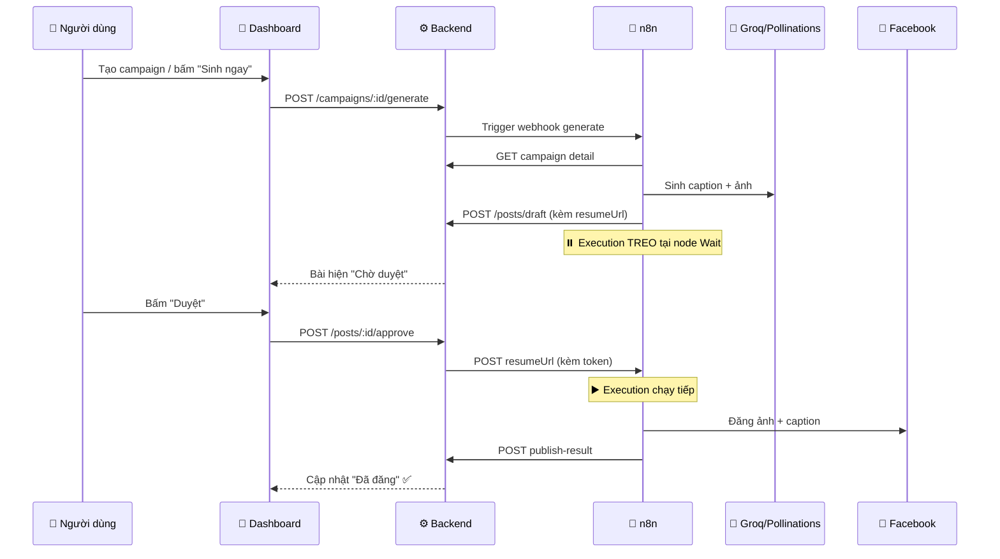

# 📘 Hướng Dẫn Cài Đặt & Sử Dụng — Social AI Content Automation

> Hệ thống tự động **tạo → duyệt → đăng** nội dung mạng xã hội, kết hợp **n8n** (automation) + **AI** (Groq sinh caption song ngữ, Pollinations sinh ảnh) + **Facebook Graph API**.

---

## 📑 Mục lục

1. [🧭 Tổng quan hệ thống](#-tổng-quan-hệ-thống)
2. [⚙️ Yêu cầu môi trường](#️-yêu-cầu-môi-trường)
3. [🚀 Cài đặt nhanh (Docker)](#-cài-đặt-nhanh-docker)
4. [🔑 Cấu hình biến môi trường](#-cấu-hình-biến-môi-trường)
5. [🤖 Thiết lập n8n workflow](#-thiết-lập-n8n-workflow)
6. [📱 Lấy Facebook Page Access Token](#-lấy-facebook-page-access-token)
7. [🖥️ Hướng dẫn sử dụng từng màn hình](#️-hướng-dẫn-sử-dụng-từng-màn-hình)
8. [🔄 Luồng hoạt động end-to-end](#-luồng-hoạt-động-end-to-end)
9. [🛠️ Xử lý sự cố thường gặp](#️-xử-lý-sự-cố-thường-gặp)

---

## 🧭 Tổng quan hệ thống

Hệ thống gồm **4 service** chạy trong Docker:

| 🧩 Service | 🔌 Port | 📝 Vai trò |
|-----------|:------:|-----------|
| 🎨 **frontend** | `3000` | Dashboard Next.js (dark premium UI) |
| ⚙️ **backend** | `4000` | NestJS REST API |
| 🤖 **n8n** | `5678` | Automation workflow (sinh + đăng bài) |
| 🗄️ **postgres** | `5432` | Cơ sở dữ liệu |

### 🏗️ Kiến trúc "Human-in-the-loop"

Toàn bộ chạy trong **1 workflow n8n hợp nhất**, treo tại node **Wait** chờ người duyệt:

```
Campaign → 🤖 AI sinh caption + ảnh → 💾 Lưu Draft → ⏸️ WAIT (chờ duyệt)
                                                          ↓ (user bấm Duyệt)
                              📤 Đăng Facebook ← ▶️ Resume execution
                                     ↓
                              📊 Callback ghi kết quả
```

---

## ⚙️ Yêu cầu môi trường

| Công cụ | Phiên bản tối thiểu | Ghi chú |
|--------|:---:|--------|
| 🐳 Docker | 20.x | Bắt buộc |
| 🐳 Docker Compose | v2 | Đi kèm Docker Desktop |
| 🔑 Tài khoản Groq | — | Lấy API key miễn phí tại [console.groq.com](https://console.groq.com/keys) |
| 📘 Facebook App | — | Cần cho OAuth / Page token |

> [!NOTE]
> Không cần cài Node.js hay PostgreSQL trực tiếp trên máy — tất cả chạy trong Docker.

---

## 🚀 Cài đặt nhanh (Docker)

### Bước 1️⃣ — Clone dự án

```bash
git clone https://github.com/vthuan-dev/social-n8n.git
cd social-n8n
```

### Bước 2️⃣ — Tạo file cấu hình

```bash
cp .env.example .env
```

Sau đó mở `.env` và điền các giá trị (xem [phần cấu hình](#-cấu-hình-biến-môi-trường) bên dưới).

### Bước 3️⃣ — Khởi động toàn bộ hệ thống

```bash
docker-compose up -d
```

### Bước 4️⃣ — Kiểm tra các service đã chạy

```bash
docker-compose ps
```

Bạn sẽ thấy 4 container ở trạng thái `Up`:

- ✅ `social_frontend`
- ✅ `social_backend`
- ✅ `social_n8n`
- ✅ `social_postgres`

### Bước 5️⃣ — Truy cập

| 🔗 Địa chỉ | 📄 Mô tả |
|-----------|---------|
| http://localhost:3000 | 🎨 Dashboard chính |
| http://localhost:4000/api | ⚙️ Backend API |
| http://localhost:5678 | 🤖 n8n editor |

> [!TIP]
> 🔐 Tài khoản admin mặc định (tạo qua seed): `admin@gmail.com` / `admin123`

---

## 🔑 Cấu hình biến môi trường

Mở file `.env` và điền các nhóm sau:

### 🗄️ Database
```env
POSTGRES_USER=social
POSTGRES_PASSWORD=social_secret
POSTGRES_DB=social_db
```

### ⚙️ Backend
```env
JWT_SECRET=<chuỗi bí mật ngẫu nhiên>
CREDENTIAL_ENCRYPTION_KEY=<đúng 32 ký tự>   # 🔒 mã hoá token MXH
WEBHOOK_SECRET=<chuỗi bí mật chung BE ↔ n8n>
```

> [!IMPORTANT]
> 🔒 `CREDENTIAL_ENCRYPTION_KEY` **phải đúng 32 ký tự** (AES-256). Sai độ dài sẽ khiến backend không khởi động được.

### 🤖 AI
```env
GROQ_API_KEY=<API key từ console.groq.com>
GROQ_MODEL=llama-3.3-70b-versatile
```

### 📘 Facebook
```env
FACEBOOK_APP_ID=<App ID>
FACEBOOK_APP_SECRET=<App Secret>
```

### 🔗 Nội bộ (giữ nguyên cho Docker)
```env
BACKEND_BASE_URL=http://backend:4000
WEBHOOK_URL=http://n8n:5678/     # ⚠️ n8n cần cái này để tạo resumeUrl đúng
```

---

## 🤖 Thiết lập n8n workflow

### Bước 1️⃣ — Đăng nhập n8n

Mở http://localhost:5678, tạo tài khoản owner lần đầu.

### Bước 2️⃣ — Import workflow

Workflow đã có sẵn tại `n8n/workflows/social-ai-pipeline.json`. Nó được **tự động import** khi container khởi động. Nếu cần import lại thủ công:

```bash
docker exec social_n8n n8n import:workflow --input=/workflows/social-ai-pipeline.json
docker restart social_n8n
```

### Bước 3️⃣ — Kích hoạt workflow

Trong n8n editor, mở workflow **"Social AI Pipeline"** và bật toggle **Active** ở góc trên phải. ✅

### 🧱 Các node trong workflow

| Node | 🎯 Chức năng |
|------|-------------|
| 📥 Webhook: Generate | Nhận trigger sinh nội dung |
| 🔍 Fetch Campaign Detail | Lấy chi tiết campaign từ backend |
| 🤖 Groq: Generate Content | AI sinh caption song ngữ + image prompt |
| 🎨 Pollinations: Image URL | Sinh URL ảnh minh hoạ |
| 💾 Save Draft to Backend | Lưu draft + `resumeUrl` |
| ⏸️ WAIT: Chờ duyệt | **Treo execution** chờ người duyệt |
| 🔀 Route by Platform | Phân nhánh theo nền tảng |
| 📤 Post to Facebook | Đăng ảnh + caption lên Page |
| 📊 Callback Publish Result | Báo kết quả về backend |

---

## 📱 Lấy Facebook Page Access Token

Có **2 cách** kết nối tài khoản Facebook:

### 🅰️ Cách 1 — OAuth (tự động, cần App Review)

1. Vào trang **Tài khoản** trên dashboard
2. Bấm **➕ Kết nối tài khoản**
3. Đăng nhập Facebook và cấp quyền cho các Page

### 🅱️ Cách 2 — Nhập token thủ công (nhanh, dùng khi chưa qua App Review)

1. Mở [Graph API Explorer](https://developers.facebook.com/tools/explorer/)
2. Chọn App → cấp quyền `pages_manage_posts`, `pages_read_engagement`, `pages_show_list`
3. Lấy **Page Access Token** (nên đổi sang long-lived token ~60 ngày)
4. Trên dashboard: **Tài khoản → 🔑 Nhập token thủ công**, dán token + Page ID

> [!WARNING]
> ⏰ Token Facebook sẽ hết hạn. Nếu bài báo lỗi `"Session has expired"`, hãy lấy token mới và kết nối lại.

---

## 🖥️ Hướng dẫn sử dụng từng màn hình

### 🔐 Màn hình Đăng nhập

- Nhập email + mật khẩu → bấm **Đăng nhập**
- Token JWT được lưu, tự đăng xuất khi hết hạn

---

### 📊 1. Tổng quan (Dashboard)

Màn hình đầu tiên sau khi đăng nhập.

**Thành phần:**
- 🔢 **4 thẻ KPI**: Tổng bài viết · Chờ duyệt · Đã đăng · Chiến dịch hoạt động
- 📈 **Biểu đồ vùng**: Số bài đăng 14 ngày qua
- 🧪 **Pipeline nội dung**: thanh tiến trình theo trạng thái (Nháp → Chờ duyệt → Đã duyệt → Đã đăng)
- 🕐 **Hoạt động gần đây**: nhật ký realtime (xanh = info, đỏ = lỗi)

---

### 📢 2. Chiến dịch (Campaigns)

Nơi định nghĩa nội dung AI sẽ sinh.

**Tạo chiến dịch mới** — bấm **➕ Chiến dịch mới**, điền:

| Trường | Ví dụ |
|-------|-------|
| 📛 Tên chiến dịch | Ra mắt sản phẩm mùa hè |
| 💡 Chủ đề | Cửa hàng laptop, điện thoại chính hãng |
| 🎭 Giọng thương hiệu | Năng động, trẻ trung, dùng emoji vừa phải |
| 🌐 Ngôn ngữ | Tiếng Việt / English / **Song ngữ** |
| ⏰ Lịch (cron) | `0 9 * * *` = 9h sáng mỗi ngày |
| ✅ Kích hoạt | Bật để tự động sinh theo lịch |

**Hành động trên mỗi thẻ chiến dịch:**
- ▶️ **Sinh ngay** — trigger AI sinh nội dung thủ công
- ✏️ **Sửa** — chỉnh sửa cấu hình
- 🗑️ **Xoá** — xoá chiến dịch (kèm các bài liên quan)

> [!TIP]
> ⏰ **Cú pháp cron**: `phút giờ ngày tháng thứ`. Ví dụ `0 9 * * *` = 9h sáng hằng ngày, `30 14 * * 1` = 14h30 thứ Hai hằng tuần. Để trống nếu chỉ muốn sinh thủ công.

---

### ✅ 3. Hàng chờ duyệt (Queue)

Trái tim của quy trình **Human-in-the-loop**.

**Bộ lọc trạng thái:** Tất cả · ⏳ Chờ duyệt · ✅ Đã duyệt · 📤 Đã đăng · ❌ Từ chối

**Mỗi bài hiển thị:** ảnh minh hoạ, caption VI/EN, hashtag, nền tảng.

**Với bài ⏳ Chờ duyệt:**
- ✅ **Duyệt** — đăng bài (resume execution n8n → đăng Facebook)
- ✏️ **Sửa** — mở panel chi tiết để chỉnh caption trước khi duyệt
- ❌ **Từ chối** — bỏ qua bài

**Panel chi tiết (khi bấm vào bài):**
- Sửa nội dung tiếng Việt / tiếng Anh
- Xem hashtag
- 💾 Lưu chỉnh sửa
- ✅ Duyệt & lên lịch đăng / ❌ Từ chối

---

### 📅 4. Lịch đăng (Calendar)

Xem lịch trình bài viết theo tháng.

- 🗓️ **Lưới lịch tháng**: mỗi ô ngày hiển thị bài đã lên lịch (màu theo trạng thái)
- ◀️ ▶️ Chuyển tháng trước/sau
- 📋 **Panel "Sắp đăng"**: 6 bài gần nhất sắp được đăng

---

### 🔗 5. Tài khoản (Accounts)

Quản lý các trang Facebook để đăng bài. *(Chỉ ADMIN)*

- ➕ **Kết nối tài khoản** — OAuth Facebook
- 🔑 **Nhập token thủ công** — dán Page Access Token
- 🔄 **Kết nối lại** — làm mới token
- 🗑️ Ngắt kết nối

**Chỉ báo trạng thái:**
- 🟢 Đã kết nối
- 🟡 Sắp hết hạn (trong 7 ngày)
- ⚪ Tạm ngưng

> [!NOTE]
> 🔒 Mọi Access Token đều được **mã hoá AES-256-GCM** trước khi lưu vào database.

---

### 📈 6. Phân tích (Analytics)

Đo hiệu suất sinh & đăng nội dung.

- 🔢 **KPI**: Tổng bài · Đã đăng · Tỷ lệ thành công · Chiến dịch hoạt động
- 📊 **Biểu đồ**: hiệu suất đăng bài theo 7/14/30 ngày
- 🍩 **Donut**: phân bổ trạng thái bài viết
- 📋 **Bảng bài gần đây**: kèm link permalink Facebook

---

## 🔄 Luồng hoạt động end-to-end



---

## 🛠️ Xử lý sự cố thường gặp

| ❗ Triệu chứng | 🔍 Nguyên nhân | ✅ Cách khắc phục |
|--------------|--------------|-----------------|
| `Session has expired` khi đăng | Token Facebook hết hạn | Lấy Page token mới, kết nối lại |
| Bài kẹt ở "Chờ duyệt", bấm Duyệt không lên | Workflow n8n chưa Active | Bật toggle Active trong n8n |
| `access to env vars denied` | Thiếu biến n8n | Đảm bảo `N8N_BLOCK_ENV_ACCESS_IN_NODE=false` trong docker-compose |
| Resume trả 404 | Sai HTTP method node Wait | Node Wait phải để `httpMethod: POST` |
| Backend không khởi động | `CREDENTIAL_ENCRYPTION_KEY` sai độ dài | Phải đúng **32 ký tự** |
| n8n không gọi được backend | Sai `BACKEND_BASE_URL` | Trong Docker phải là `http://backend:4000` |

### 📋 Xem log các service

```bash
docker logs social_backend --tail 50    # ⚙️ Backend
docker logs social_n8n --tail 50         # 🤖 n8n
docker logs social_frontend --tail 50    # 🎨 Frontend
```

---

## 🎯 Tóm tắt quy trình 5 bước

1. 📢 **Tạo chiến dịch** (chủ đề + brand voice + lịch)
2. 🤖 **AI sinh nội dung** (tự động theo lịch hoặc bấm "Sinh ngay")
3. ✅ **Duyệt bài** trong Hàng chờ (sửa nếu cần)
4. 📤 **Tự động đăng** lên Facebook Page
5. 📊 **Theo dõi** kết quả trong Phân tích

---

> 💜 Chúc bạn sử dụng hệ thống hiệu quả! Mọi thắc mắc xem thêm tại [README.md](../README.md) và [n8n/README.md](../n8n/README.md).
