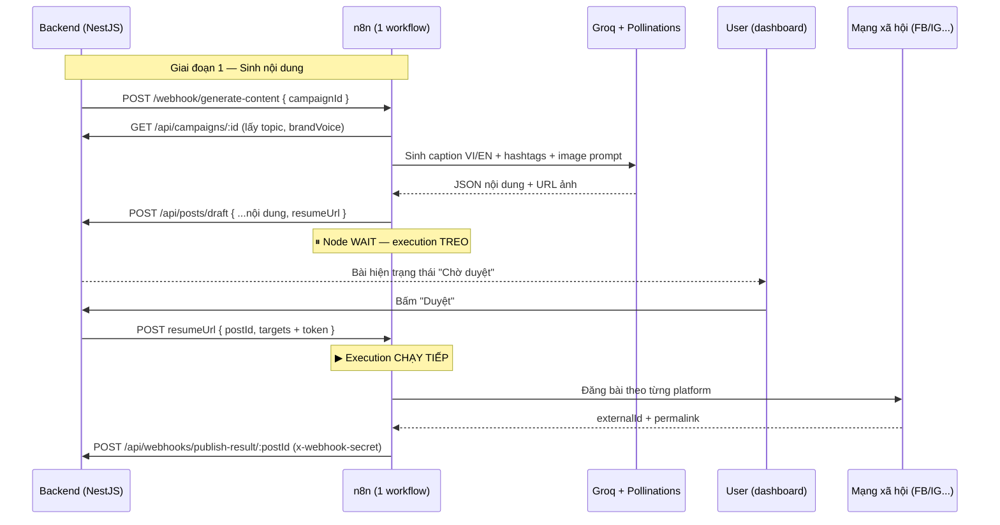

# n8n Workflows — Hệ thống tự động sinh nội dung MXH

Thư mục này chứa **1 workflow n8n hợp nhất** (human-in-the-loop) phục vụ automation cho hệ thống:

| Workflow | File | Vai trò |
|----------|------|---------|
| **Social AI Pipeline** | `workflows/social-ai-pipeline.json` | Nhận trigger từ backend → gọi AI (Groq) sinh caption song ngữ + ảnh → lưu draft → **dừng tại node Wait chờ duyệt** → khi user duyệt thì tự chạy tiếp đăng bài → callback kết quả |

> [!NOTE]
> Trước đây tách làm 2 workflow (`generate-content` + `publish-content`). Nay gộp thành **1 execution xuyên suốt**: workflow treo tại node **Wait** cho tới khi user bấm Duyệt trên dashboard, backend POST vào `resumeUrl` để workflow chạy tiếp. Nhờ đó tab **Executions** hiển thị đúng tiến trình từ đầu đến cuối.

---

## 1. Kiến trúc luồng dữ liệu



> [!IMPORTANT]
> Token đăng bài **không** lưu ở n8n. Chỉ khi user duyệt, backend mới giải mã token (AES-256) và bơm vào `resumeUrl` — giữ nguyên nguyên tắc bảo mật.

---

## 2. Import workflow vào n8n

1. Mở n8n tại `http://localhost:5678` (sau khi chạy `docker-compose up`).
2. Vào **Workflows → Import from File**.
3. Chọn file `workflows/social-ai-pipeline.json`.
4. Sau khi import, **Activate** workflow (toggle góc trên phải).

> [!IMPORTANT]
> Webhook path phải khớp biến môi trường backend:
> - `generate-content` ↔ `N8N_WEBHOOK_GENERATE` (điểm trigger duy nhất)
>
> `N8N_WEBHOOK_PUBLISH` chỉ còn dùng làm **fallback** cho bài tạo tay (không qua workflow). Luồng chính dùng cơ chế `resumeUrl` của node Wait, không cần path publish riêng.

> [!TIP]
> Để `resumeUrl` hoạt động, biến `WEBHOOK_URL` của n8n phải trỏ tới địa chỉ mà backend gọi được. Trong Docker, đó là service name: `WEBHOOK_URL=http://n8n:5678/` (đã cấu hình sẵn trong `docker-compose.yml`).

---

## 3. Cấu hình biến môi trường n8n

Các workflow dùng các biến `$env` sau. Thêm vào service `n8n` trong `docker-compose.yml` (mục `environment`) hoặc trong UI **Settings → Variables**:

| Biến | Ý nghĩa | Ví dụ |
|------|---------|-------|
| `BACKEND_BASE_URL` | URL nội bộ tới backend | `http://backend:4000` |
| `WEBHOOK_SECRET` | Shared secret xác thực callback | (khớp `WEBHOOK_SECRET` của backend) |
| `GROQ_API_KEY` | API key Groq (OpenAI-compatible) | lấy tại https://console.groq.com/keys |
| `GROQ_MODEL` | Model Groq dùng để sinh nội dung | `llama-3.3-70b-versatile` |

---

## 4. Cấu hình Credentials

### Groq (sinh nội dung)
Node **Groq: Generate Content** dùng HTTP Request gọi thẳng API OpenAI-compatible của Groq, xác thực qua header `Authorization: Bearer {{ $env.GROQ_API_KEY }}`. Không cần tạo credential riêng trong n8n — chỉ cần đặt biến môi trường `GROQ_API_KEY` (đã cấu hình sẵn trong `docker-compose.yml`).

> [!TIP]
> Groq có free tier tốc độ cao. Đổi model bằng biến `GROQ_MODEL` (mặc định `llama-3.3-70b-versatile`).

### Facebook / Instagram (workflow publish)
1. Node đăng bài dùng token đã lưu (mã hoá AES-256) trong DB, backend giải mã và truyền qua payload — **không** cần lưu token trong n8n.
2. Nếu muốn dùng node Facebook Graph native của n8n, tạo credential **Facebook Graph API** và gán vào node tương ứng.

> [!NOTE]
> Kiến trúc mặc định: backend là nơi giữ token (đã mã hoá). n8n chỉ nhận token trong payload publish để gọi Graph API, tránh lưu credential nhạy cảm ở 2 nơi.

---

## 5. Bảo mật webhook

- **Backend → n8n**: mọi request đính kèm header `x-webhook-secret`. Node webhook n8n có thể kiểm tra header này bằng một node **IF** đầu luồng (tuỳ chọn nâng cao).
- **n8n → Backend**: mọi callback (`/posts/draft`, `/webhooks/publish-result/:postId`) đều gửi header `x-webhook-secret`, được `WebhookSecretGuard` phía backend xác thực.

---

## 6. Test nhanh

```bash
# Trigger sinh nội dung thủ công (thay <campaignId>)
curl -X POST http://localhost:5678/webhook/generate-content \
  -H "Content-Type: application/json" \
  -d '{"campaignId": "<campaignId>"}'
```

Sau vài giây, kiểm tra tab **Hàng chờ duyệt** trên dashboard — draft mới sẽ xuất hiện ở trạng thái *Chờ duyệt*.
